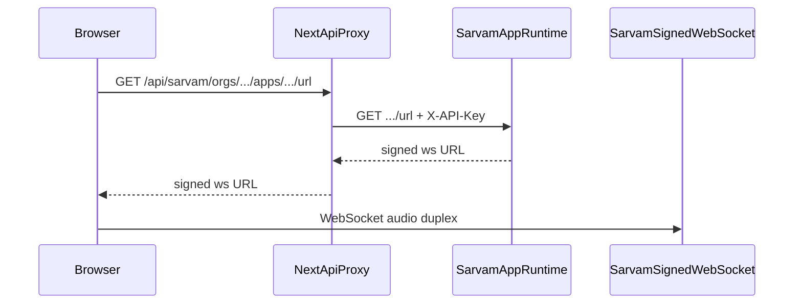

# Next.js + Sarvam Voice Agent

## What we’re building
A new Next.js (App Router + TypeScript) app in this workspace with a simple DeWork Labs landing page and a **Talk to agent** voice call using `sarvam-conv-ai-sdk/browser`. The browser never sees the real API key; a Next.js route proxies only the signed WebSocket URL request.

## Confirmed config
| Field | Value |
| --- | --- |
| `org_id` | `019fe198-c0a5-707c-884d-be8d46ea2813` |
| `workspace_id` | `019fe198-c0a8-7f1e-a61d-f0126a4259f2` |
| `app_id` | `deWork-Labs-849b2bc4-7cc5` |
| `version` | `1` (v1) |
| `interaction_type` | `CALL` |
| Sample rates | `16000` in / `16000` out |
| `agent_variables` | `call_summary=""`, `caller_name=""`, `caller_phone_number=""`, `handler_name="Riya"` |
| API key | Seed `SARVAM_API_KEY` in `.env.local` from [`HTML-Embed.html`](HTML-Embed.html) (gitignored); never `NEXT_PUBLIC_` |

## Architecture

The JS SDK (`ConversationAgent`) only uses the API key for that signed-URL HTTP GET (`baseUrl` default `https://apps.sarvam.ai/api/app-runtime/`). After that, audio streams on the signed WebSocket.

## Implementation steps

### 1. Scaffold Next.js app
- Create App Router + TS + Tailwind project in the workspace root (or a clear subfolder if scaffolding requires an empty dir — prefer root since it only has `HTML-Embed.html` / `prompt_1`).
- Add dependency: `sarvam-conv-ai-sdk`.
- Add `.env.local` with `SARVAM_API_KEY=...` from the embed snippet; add `.env.example` with empty placeholder.
- Ensure `.gitignore` covers `.env.local`.

### 2. Server proxy (key stays server-side)
- Add [`app/api/sarvam/[...path]/route.ts`](app/api/sarvam/[...path]/route.ts) that:
  - Forwards `GET` to `https://apps.sarvam.ai/api/app-runtime/{path}?{query}`
  - Injects `X-API-Key: process.env.SARVAM_API_KEY`
  - Returns upstream status/body (including errors)
  - Does not log the key
- Client SDK config: `baseUrl: "/api/sarvam/"` and a dummy client `apiKey` (overwritten by proxy headers on the server hop). Real key never bundled.

### 3. Voice client component
- Client component (e.g. [`components/TalkToAgent.tsx`](components/TalkToAgent.tsx)) using:
  - `ConversationAgent`, `BrowserAudioInterface`, `InteractionType` from `sarvam-conv-ai-sdk/browser`
  - Fixed IDs above + `version: 1` + confirmed `agent_variables`
  - `user_identifier_type: "custom"` and a per-session `user_identifier` (e.g. `web-${crypto.randomUUID()}`)
  - Start / Stop controls, connection status, basic error UI
  - `await agent.start()` → `waitForConnect(10)`; always `stop()` on unmount / errors (`finally`)

### 4. Dummy landing page
- Single-composition landing in [`app/page.tsx`](app/page.tsx): DeWork Labs brand, short headline, one CTA group that starts the voice agent.
- Keep it intentionally simple (dummy page), on-brand enough for DeWork Labs Receptionist — not a dashboard.

### 5. Docs for local run
- Short README: `npm install`, set `.env.local`, `npm run dev`, allow mic, note HTTPS/localhost mic requirements.

## Out of scope
- Full WebSocket audio bridge (Python-style) — unnecessary because the browser SDK already uses signed URLs.
- Hardcoding the API key in client/widget markup.
- Telephony / outbound campaigns.
